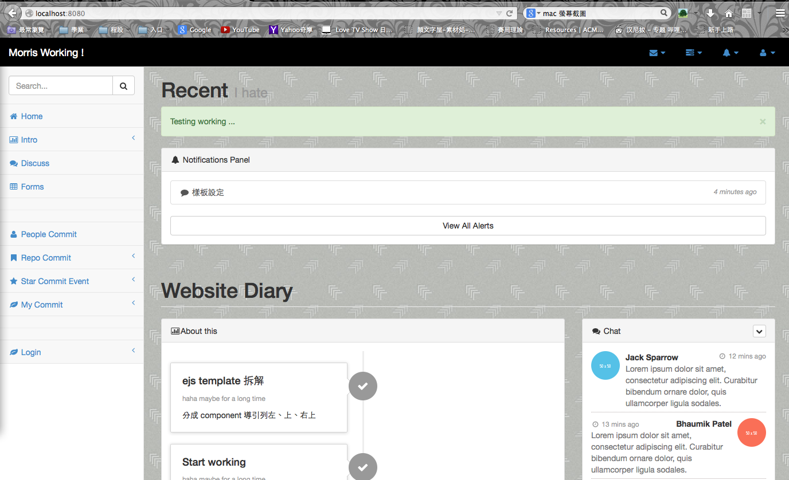
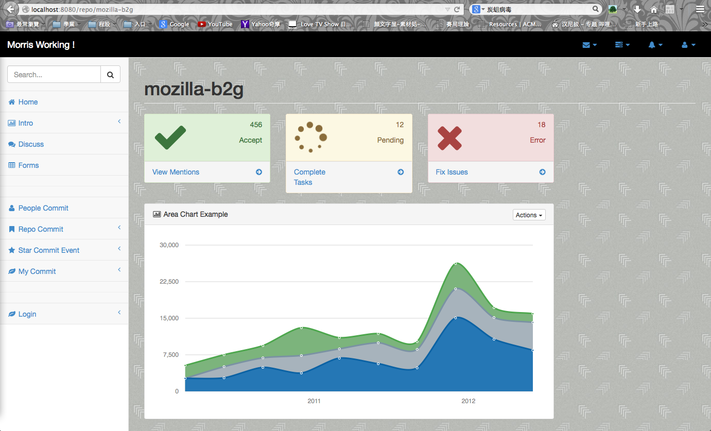

進度
======
## 待辦 ##
* 記錄每一個人不同想要追蹤的 repo 和 people
* 對於追蹤 repo 上，採用近期總計 和 commit token cloud 
* 註冊頁面
* localhost:8080/search 會有重複資料處理未完
* json 的頁面供 javascript 製作圖表

## 完成 ##
* 登入操作 by Google OpenID
* 聊天討論操作 socket.io
* 重新套用模板，將其拆解成數個 component 轉換到 nodejs 運行
* 確定資料庫的基礎讀寫
* 後端短時間內造訪太多次，被 Travis CI 封鎖
* 在後端測試上，請參考 [travis-report-prototype](https://github.com/morris821028/travis-report-prototype)

起因
=====

大學部專題製作，查閱連續整合的 Travis CI 與 Github 之間的聯繫，
目標做一個更容易追蹤 repo 的運行狀態。

第一次使用 nodejs 架站。

素材
=====
* nodejs express 
* mongodb
* bootstrap sb admin 2

展示
=====

## 首頁 ##

## 追蹤 Repo 首頁 ##

## 更多 ##

Install
=====

First,

`$ git clone https://github.com/morris821028/hw-reporter-website`

Seond, open folder hw-reporter-website, install npm plugin

`$ npm install`

Third, Check your mongoDB open

* Linux

`$ mongod`

* Windows

`$ C:\mongo\bin\mongod`

Final, run !

`$ node server.js`